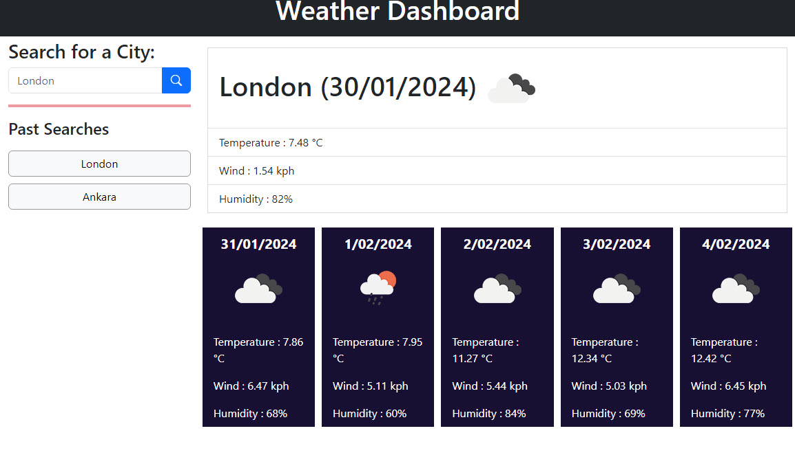

  

  <h3 align="center">Weather Dashboard by using JS, JQuery, dayJs</h3>

  

    This is a Weather Dasboard that has following options :
    <ul align="center" style="list-style-type: none">
      <li>Current and 5-days forecast weather information</li>
      <li>Previous searched stored in local storage</li>
      <li>Visual demonstration of weather status</li>
     
    
  

 

  <h1> <a href="https://ozdilkazim.github.io/WeatherDashboard">SEE LIVE PAGE</a></h1>

 

## Documentation for previous releases

- No previous release.

## Community

Get updates on Javascript Tutorial to learn how to code.

- W3 Schools JavaScript Tutorial (https://www.w3schools.com/js/).
- Learn JavaScript (https://learnjavascript.online/).
- The Modern JavaScript Tutorial (https://javascript.info/).

## Creator(s)

**Kazim OZDIL**

- <https://github.com/ozdilkazim>

## Copyright and license

Code and documentation copyright under MIT license